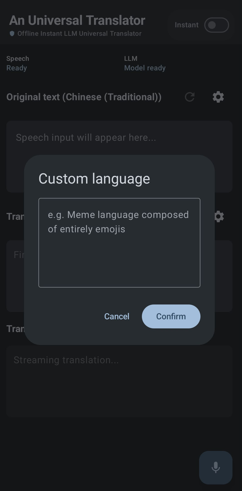

# An Universal Translator - Offline Instant LLM Universal Translator

## Feature

 Feature | Visual |
| :--- | :--- |
| **Material 3 Native UI**: Built with Jetpack Compose to provide a seamless, modern, and intuitive user experience following current design principles. |  |
| **Universal Monolithic Architecture**: Unlike legacy engines requiring discrete downloads, this application leverages a single, unified model supporting **100+ languages out-of-the-box** ([See supported languages](docs/TOP_100_LANGUAGES_BY_POPULATION.md)) for a true universal translator experience. |  |
| **Absolute Data Sovereignty**: 100% of inference is executed locally with zero network requests, ensuring security and privacy in air-gapped or secure environments. |  |
| **Streaming Inference Engine**: Real-time partial results are rendered as the user speaks, delivering a low-latency feedback loop that traditional "capture-then-process" architectures cannot match. | *(Integrated into main interface)* |
| **Programmable Translation**: The translation logic is decoupled from the core engine, allowing developers to inject "Styles" via prompt engineering for context-aware, professionally-tailored outputs. |  |
| **Stateful Error Recovery**: Includes a robust state management system for manual speech-to-text (STT) correction and re-inference, ensuring high precision in critical communication scenarios. |  |

## Use Cases
* Secure Enterprise & Sovereign Communications: Protect high-value intellectual property and ensure regulatory compliance (GDPR/CCPA) by eliminating "cloud leakage" through 100% on-device, air-gapped inference for executive and legal proceedings.
* Critical Infrastructure & Remote Operations: Minimize operational downtime and safety risks in connectivity "dead zones" with a monolithic offline model that provides zero-latency communication without the logistical overhead of per-language pack management.
* Connectivity-Constrained Aviation & Maritime Operations: Remove the communication barriers inherent in high-altitude or oceanic environments by deploying autonomous inference that functions independently of restricted, high-latency, or high-cost satellite networks.
* Semantic Localization: Scale brand-aligned international engagement through programmable prompt engineering, enabling real-time injection of technical, professional, or cultural styles that traditional "robot-speak" translation engines cannot achieve.

## Limitation
* The application is optimized for devices with high-performance neural processing units (NPUs). Speech recognition currently supports flagship silicon from the following partners:
    * Google: Pixel 9/10 Series
    * Samsung: Galaxy S25/S26 Series, Z Fold7
    * Xiaomi: 15/17 Series
    * OPPO/vivo: Find X8/X9, X200/X300 Series
    * OnePlus/Honor: 13/15 Series, Magic 7/8 Series (Full list of validated models available in [SUPPORTED_DEVICES.md](docs/SUPPORTED_DEVICES.md))

## Roadmap
* Scenario Specific Templates: Develop a library of pre-built prompt templates tailored for specific use cases like business meetings, travel, and meme translations, allowing users to easily select and apply the appropriate translation style.
* Image Translation: Extend the translation capabilities to include image-based text recognition and translation, enabling users to translate signs, menus, and other written materials in real-time using their device's camera.