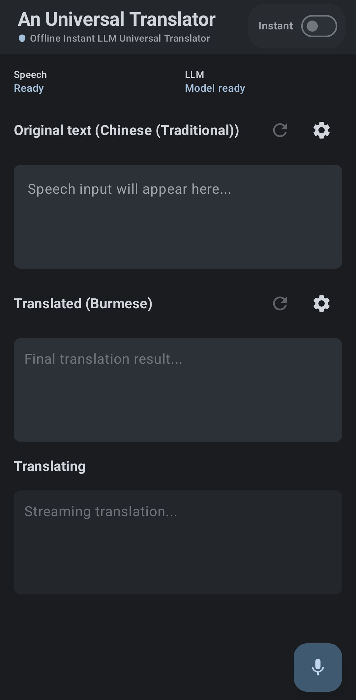
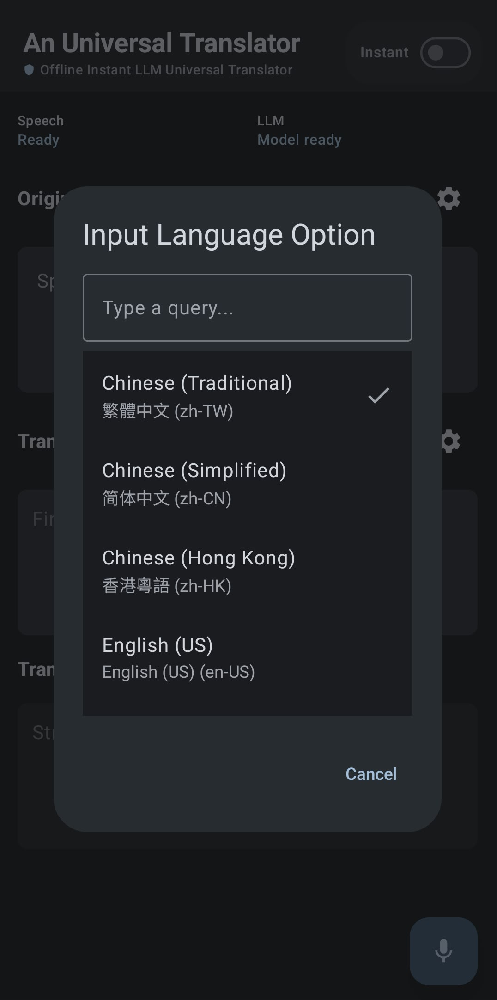
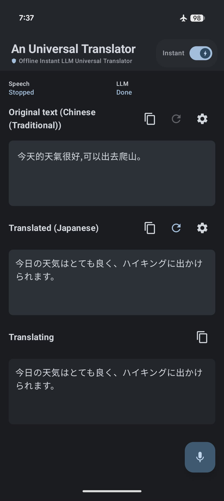
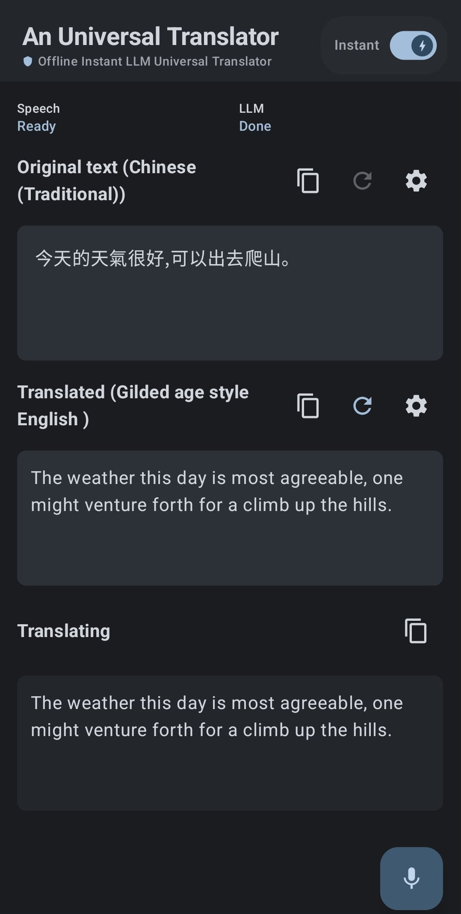

# An Universal Translator - Offline Instant LLM Universal Translator

A Universal Translator is a fast and private app that helps you communicate in over 100 languages without ever needing an internet connection. While older tools require you to download separate files for every new language, this app has everything built-in and ready to go from the moment you install it. Because all the work happens directly on your phone, your conversations stay completely private and never leave your device. The app uses latest on-device LLM model for real-time speech recognition and translation, so you can explore the world and connect with people across language barriers without worrying about connectivity or privacy.

## Feature

 Feature | Visual |
| :--- | :--- |
| **Material 3 Native UI**: Built with Jetpack Compose to provide a seamless, modern, and intuitive user experience following latest Android design principles. |  |
| **Universal Monolithic Architecture**: Unlike legacy engines requiring discrete downloads, this app leverages a single, unified model supporting **100+ languages out-of-the-box** ([See supported languages](docs/TOP_100_LANGUAGES_BY_POPULATION.md)) for a true universal translator experience. |  |
| **Absolute Data Sovereignty**: 100% of inference is executed locally with zero network requests, ensuring total security and privacy in air-gapped or secure environments. |  |
| **Streaming Inference Engine**: Real-time partial results are rendered as you speak, delivering a low-latency feedback loop that outperforms traditional "capture-then-process" architectures. | *(Sub-second latency on optimized devices)* |
| **Programmable Translation**: Translation logic is decoupled from the core engine, allowing developers to inject "Styles" via prompt engineering for context-aware, professional outputs. |  |
| **Stateful Error Recovery**: Includes a robust state management system for manual speech-to-text (STT) correction and re-inference, ensuring high fault tolerance. | *(Retriable workflow for speech and LLM steps)* |

## Use Cases
* Secure Enterprise & Sovereign Communications: Protect high-value intellectual property and ensure regulatory compliance (GDPR/CCPA) by eliminating "cloud leakage" through 100% on-device inference for executive and legal proceedings.
* Critical Infrastructure & Remote Operations: Minimize operational downtime and safety risks in connectivity "dead zones" with a monolithic model that provides zero-latency communication without the overhead of per-language pack management.
* Connectivity-Constrained Aviation & Maritime Operations: Remove communication barriers in high-altitude or oceanic environments by deploying autonomous inference that functions independently of restricted, high-cost satellite networks.
* Semantic Localization: Scale brand-aligned international engagement through programmable prompt engineering, enabling real-time injection of technical, professional, or cultural styles.

## Limitation
* The application is optimized for devices with high-performance neural processing units (NPUs). Speech recognition currently supports flagship silicon from the following series:
    * Google: Pixel 9/10 Series
    * Samsung: Galaxy S25/S26 Series, Z Fold7
    * Xiaomi: 15/17 Series
    * OPPO/vivo: Find X8/X9, X200/X300 Series
    * OnePlus/Honor: 13/15 Series, Magic 7/8 Series (Full list of validated models available in [SUPPORTED_DEVICES.md](docs/SUPPORTED_DEVICES.md))

## Roadmap
* Scenario-Specific Templates: Develop a library of pre-built prompt templates tailored for specific use cases like business meetings, travel, and meme translations, allowing users to easily select and apply the appropriate translation style.
* Image Translation: Expanding capabilities to include image-based text recognition (OCR) for translating signs, menus, and documents in real-time via the camera.
* File Translation: Implement support for translating documents, PDFs, and other file formats directly within the app, providing a comprehensive solution for both spoken and written language translation needs.
* Context Menu Integration: Integrate translation features into the Android system context menu, allowing users to translate text from any app without needing to switch to the translator app, enhancing convenience and accessibility across the device.
* WearOS Support: Expand the application's compatibility to WearOS devices, enabling users to access translation features directly from their smartwatches for on-the-go communication without needing to pull out their phones.